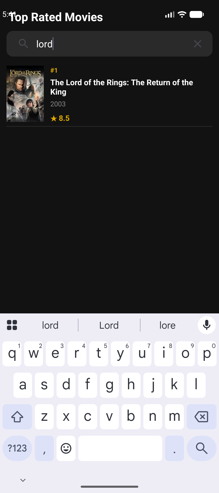
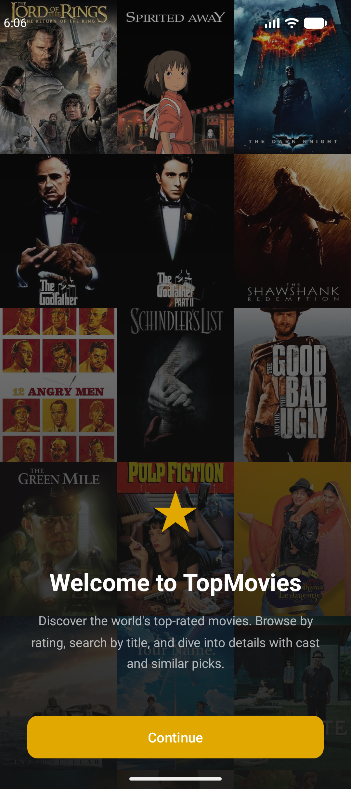

# TopMovies

Android-приложение для просмотра фильмов с высоким рейтингом на основе [TMDB](https://www.themoviedb.org/).

## Возможности

- Список топ фильмов с бесконечной прокруткой и пагинацией
- Экран деталей: жанры, продолжительность, режиссёр, актёры, похожие фильмы
- Анимация общего элемента при переходе между экранами
- Скелетон-экран загрузки, pull-to-refresh, обработка ошибок
- **Поиск по названию** в реальном времени через Room (LIKE-запрос) с RxJava debounce — лишние запросы к БД при быстром вводе отменяются автоматически
- **Экран «ничего не найдено»** — при пустых результатах поиска вместо пустого экрана показывается понятное сообщение
- **Кэш Room DB** — список загружается из базы данных без сети; pull-to-refresh сбрасывает кэш и тянет свежие данные
- **Экран приветствия** показывается при каждом третьем запуске (счётчик в SharedPreferences)
- Архитектура MVVM: ViewModel + StateFlow + RxJava 3

## Технологии

| Слой | Технология |
|------|-----------|
| Язык | Kotlin |
| Архитектура | MVVM + Repository |
| Асинхронность | RxJava 3 + StateFlow |
| Реактивный поиск | PublishSubject + debounce + switchMapSingle |
| Сеть | Retrofit 2 + Gson + RxJava3CallAdapterFactory |
| Локальная БД | Room 2.8.4 + room-rxjava3 + KSP 2.2.10 |
| Изображения | Glide |
| UI | View Binding, RecyclerView, DiffUtil |
| Хранилище | SharedPreferences |
| Мин. версия | SDK 24 (Android 7.0) |

## Настройка

1. Получите бесплатный API-ключ на [themoviedb.org](https://www.themoviedb.org/settings/api)
2. Добавьте его в файл `local.properties`:
   ```
   tmdb.api_key=ВАШ_КЛЮЧ
   ```
3. Соберите и запустите проект в Android Studio

> **Без ключа** приложение покажет диалог с инструкцией при первом запуске.

### Архитектура RxJava

Слой данных полностью построен на RxJava 3:

```
EditText (TextWatcher)
    └─► ViewModel.searchMovies(query)
            └─► PublishSubject<String>
                    ├─ debounce(300ms)        — отменяет промежуточные запросы
                    ├─ distinctUntilChanged() — не запрашивает повторно тот же текст
                    └─ switchMapSingle { dao.searchMovies(query) }
                                              — отменяет предыдущий запрос к БД

Сеть/кэш:
    Repository.getTopRatedMovies(page)
        └─► dao.getMoviesByPage(page)          : Single<List<MovieEntity>>
                ├─ [кэш есть] → Single.just(cached)
                └─ [нет]      → api.getTopRatedMovies()  : Single<MovieResponse>
                                    .doOnSuccess { сохранить totalPages }
                                    .flatMap { dao.insertMovies(...).andThen(Single.just(it)) }
```

Все подписки хранятся в `CompositeDisposable` и очищаются в `ViewModel.onCleared()`.

### Конфигурация сборки

Имя базы данных задаётся через `BuildConfig.DB_NAME` в `app/build.gradle.kts` — его можно переопределить для разных build-вариантов:

```kotlin
buildConfigField("String", "DB_NAME", "\"movies_debug.db\"")
```

## Скриншоты

| Список | Поиск | Детали | Приветствие |
|--------|-------|--------|-------------|
|  |  |  |  |
