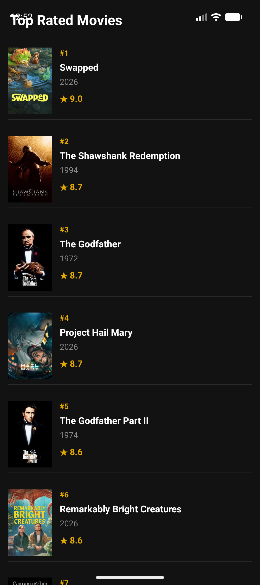
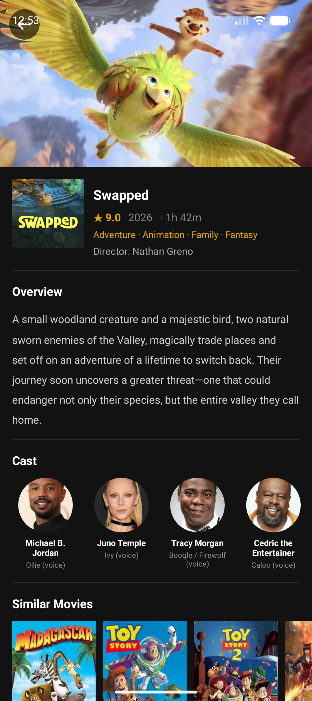

# TopMovies

Android app that displays top-rated movies from [TMDB](https://www.themoviedb.org/).

## Features

- Top-rated movies list with infinite scroll pagination
- Movie detail screen: genres, runtime, director, cast, similar movies
- Shared element transition animation between list and detail
- Skeleton loading screen, pull-to-refresh, error handling
- MVVM architecture: ViewModel + StateFlow + Coroutines

## Tech Stack

| Layer | Technology |
|-------|-----------|
| Language | Kotlin |
| Architecture | MVVM |
| Async | Coroutines + StateFlow |
| Networking | Retrofit 2 + Gson |
| Images | Glide |
| UI | View Binding, RecyclerView, DiffUtil |
| Min SDK | 24 (Android 7.0) |

## Setup

1. Get a free API key at [themoviedb.org](https://www.themoviedb.org/settings/api)
2. Add it to `local.properties`:
   ```
   tmdb.api_key=YOUR_KEY_HERE
   ```
3. Build and run in Android Studio

## Screenshots

| List | Detail |
|------|--------|
|  |  |
